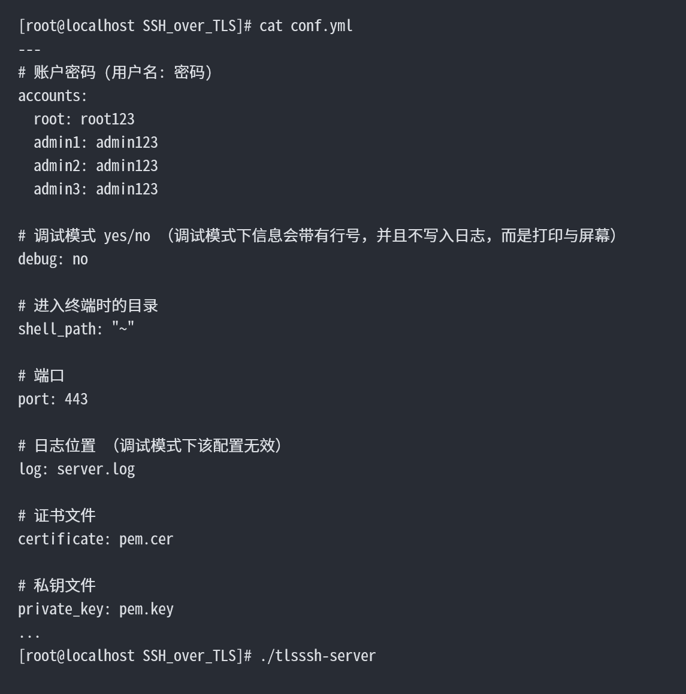
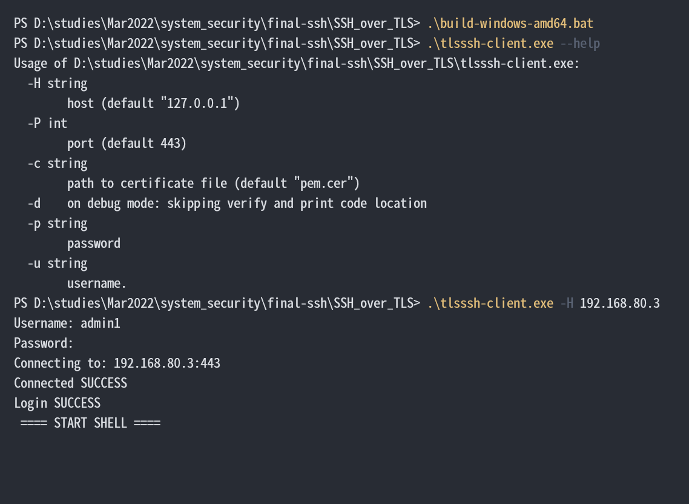
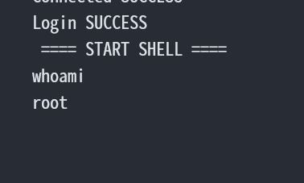
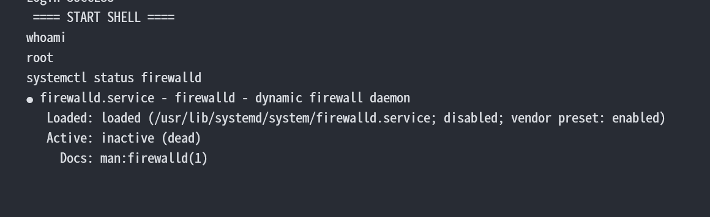
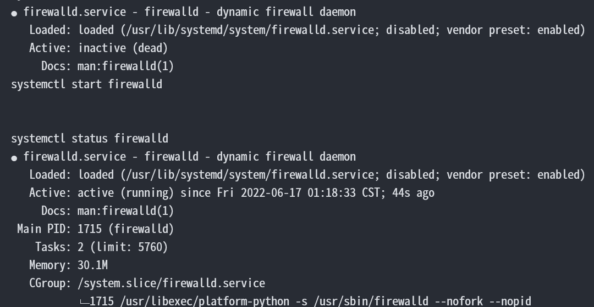
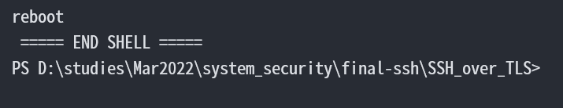

## 功能与流程设计

### 功能

该软件使用golang作为主要编程语言。其拥有稳定而丰富的官方库与大量的第三方工具库可以使用。

该软件的主要功能为：
1. 生成PEM证书
2. 建立TLS连接
3. 在TLS连接的基础上运行SSH
4. 通过SSH进行服务器的配置
5. 服务器日志记录：登录用户与ip

### 流程设计



### 使用方法

1. 修改配置文件与 sign.sh 中 ip 地址相关参数
2. 运行 sign.sh 生成密钥与证书
3. 运行服务器
4. 运行客户端

## 程序设计与实现

### 生成证书

生成证书主要由bash脚本构成，使用了 Openssl

```bash
HOST=192.168.80.3

openssl req -new \
	-newkey rsa:2048 \
	-keyout pem.key -out pem.cer \
	-nodes -x509 \
	-days 3650 \
	-subj "/C=CN/ST=Beijing/L=Beijing/O=Me/OU=Me/CN=me.org" \
	-addext "subjectAltName = IP:$HOST"
```

### 建立TLS连接

建立TLS的过程主要使用了golang的官方TLS库

### 服务端

#### 设定密钥

```golang
	// 读取、设定密钥、证书
	cert, err := tls.LoadX509KeyPair(Cfg.Certificate, Cfg.Private_key)
	if err != nil {
		log.Panicf("LoadX509KeyPair FAILED: %v", err)
	}
	tls_config := &tls.Config{Certificates: []tls.Certificate{cert}}
```

#### 建立socket连接

```golang
	// 端口监听
	listener, err := tls.Listen("tcp", ":"+strconv.Itoa(Cfg.Port), tls_config)
	if err != nil {
		log.Panicf("Listen ERROR: %v", err)
		return
	}
	defer listener.Close()
	log.Printf("Listening at: %v", Cfg.Port)

	// 接受到一个新连接
	for {
		conn, err := listener.Accept()
		if err != nil {
			log.Printf("Accept connection ERROR: %v", err)
			continue
		}
		log.Printf("New connection from: %v", conn.RemoteAddr().String())
		go handleConn(conn)
	}
```

#### 建立TLS与SSH连接并打开连接至shell

```golang
// 新连接处理线程
func handleConn(net_conn net.Conn) {
	defer net_conn.Close()

	// 服务安全配置
	server_config := &ssh.ServerConfig{
		PasswordCallback: func(
			c ssh.ConnMetadata, password []byte,
		) (*ssh.Permissions, error) {
			pw, ok := Cfg.Accounts[c.User()]
			if ok && pw == string(password) {
				return nil, nil
			}
			return nil, errors.New("password rejected for " + c.User())
		},
	}
	privateBytes, err := ioutil.ReadFile(Cfg.Private_key)
	if err != nil {
		log.Fatal("Failed to load private key: ", err)
	}

	private, err := ssh.ParsePrivateKey(privateBytes)
	if err != nil {
		log.Fatal("Failed to parse private key: ", err)
	}

	server_config.AddHostKey(private)

	// TLS 基础上建立连接
	conn, chans, reqs, err := ssh.NewServerConn(net_conn, server_config)
	if err != nil {
		log.Printf("Handshake FAILED: %v", err)
		return
	}
	log.Printf("Login SUCCESS: %v", conn.User())

	// 回调设置
	// The incoming Request channel must be serviced.
	go ssh.DiscardRequests(reqs)

	// Service the incoming Channel channel.
	for newChannel := range chans {
		// Channels have a type, depending on the application level
		// protocol intended. In the case of a shell, the type is
		// "session" and ServerShell may be used to present a simple
		// terminal interface.
		if newChannel.ChannelType() != "session" {
			newChannel.Reject(ssh.UnknownChannelType, "unknown channel type")
			log.Printf("Receive unknown channel type: %v", newChannel.ChannelType())
			continue
		}
		channel, requests, err := newChannel.Accept()
		if err != nil {
			log.Printf("Accept channel ERROR: %v", err)
			continue
		}

		// Sessions have out-of-band requests such as "shell",
		// "pty-req" and "env".  Here we handle only the
		// "shell" request.
		go func(in <-chan *ssh.Request) {
			for req := range in {
				req.Reply(req.Type == "shell", nil)
			}
		}(requests)

		go func() {
			defer channel.Close()
			// 打开终端
			cmd := exec.Command(SHELL_CMD[0], SHELL_CMD[1:]...)
			// 运行
			cmd.Stdin = channel
			cmd.Stdout = channel
			cmd.Stderr = channel
			log.Printf("Start shell")
			err = cmd.Run()
			if err != nil {
				log.Printf("Start command ERROR: %v", err)
				return
			}
			log.Printf("End shell")
		}()
	}
}
```

### 客户端

#### 设定证书

```golang
	// 读取、设定证书
	ca_cert, err := ioutil.ReadFile(Cfg.Certificate)
	if err != nil {
		log.Panicf("Read file %v FAILED: %v", Cfg.Certificate, err)
	}
	pool := x509.NewCertPool()
	pool.AppendCertsFromPEM(ca_cert)

	tls_cfg := &tls.Config{
		RootCAs: pool,
	}
	if Cfg.Debug {
		tls_cfg.InsecureSkipVerify = true
	}
```

#### 建立TLS连接

```golang
	// 连接
	url := Cfg.Host + ":" + strconv.Itoa(Cfg.Port)
	log.Printf("Connecting to: %v", url)
	// tls_conn, err := tls.Dial("tcp", url, tls_cfg)
	tls_dialer := tls.Dialer{Config: tls_cfg}
	net_conn, err := tls_dialer.Dial("tcp", url)
	if err != nil {
		log.Panicf("Connecting FAILED: %v", err)
	}
	log.Printf("Connected SUCCESS")
	defer net_conn.Close()
```

#### 建立SSH连接并与控制台连接

```golang
	// 建立 ssh 客户端
	client_config := &ssh.ClientConfig{
		User: Cfg.Account.Username,
		Auth: []ssh.AuthMethod{
			ssh.Password(Cfg.Account.Password),
		},
		HostKeyCallback: func(
			hostname string,
			remote net.Addr,
			key ssh.PublicKey,
		) error {
			return nil
		},
	}
	conn, chans, reqs, err := ssh.NewClientConn(net_conn, url, client_config)
	if err != nil {
		log.Printf("Handshake FAILED: %v", err)
		return
	}
	log.Println("Login SUCCESS")
	client := ssh.NewClient(conn, chans, reqs)

	// 建立会话
	session, err := client.NewSession()
	if err != nil {
		log.Printf("Create session FAILED: %v", err)
		return
	}
	defer session.Close()

	// 建立终端
	input := newReader()
	session.Stdout = os.Stdout
	session.Stderr = os.Stderr
	session.Stdin = input
	// 交互
	log.Println(" ==== START SHELL ====")
	defer log.Println(" ===== END SHELL =====")
	session.Shell()
	session.Wait()
```

## 测试用例与实验分析

### 打开服务器



### 连接



出现`START SHELL`即连接成功

### 配置服务器

此时已经获得服务器shell，可以随意控制服务器。

比如查看当前用户



查看防火墙状态



打开防火墙



查看网络状态


甚至重启



此时连接就会断开

## 第三方资源说明

使用了如下第三方库：

```
require (
	golang.org/x/crypto v0.0.0-20220525230936-793ad666bf5e
	gopkg.in/yaml.v3 v3.0.1
)
```

严格来说crypto其实也属于官方库，但由于不满足稳定性承诺，被放在了x库中。

主要使用了crypto中ssh用于ssh连接，以及yaml读取yaml格式的配置文件

其余库皆为官方标准库。
